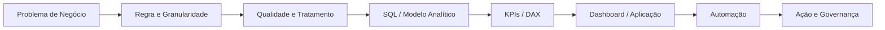
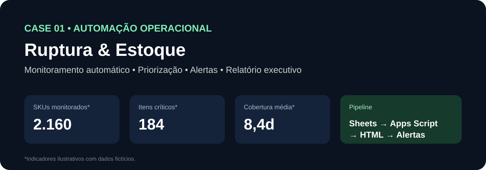

### Data Analytics • Automação • Supply Chain • Data Products

**Transformando problemas operacionais em dados confiáveis, indicadores acionáveis e automações que melhoram a execução.**

---

## Sobre mim

Sou um profissional de **Dados, Planejamento e Automação**, com atuação próxima à operação e foco em transformar necessidades de negócio em soluções estruturadas de ponta a ponta.

Minha experiência combina **Supply Chain, gestão de mix, cadastro de produtos, indicadores, dashboards, automação de processos e desenvolvimento de aplicações internas**, conectando contexto operacional com tecnologia para apoiar decisões mais rápidas e reduzir atividades manuais.

Tenho formação em **Banco de Dados** e atualmente amplio minha visão de negócio e execução com **MBA em Planejamento e Projetos**.

Mais do que construir dashboards, procuro entender o problema, definir regras, estruturar dados, criar indicadores confiáveis, automatizar a rotina e garantir que a informação resulte em **ação operacional e decisão**.

> **Meu foco:** dados com contexto de negócio, automação com propósito e soluções simples de usar.

---

## Como gero valor

| Frente | Como atuo |
|---|---|
| **Data Analytics** | Estruturação de bases, análise exploratória, SQL, modelagem, KPIs, DAX e dashboards executivos |
| **Automação de Processos** | Transformação de rotinas manuais em fluxos automatizados, alertas, relatórios e integrações |
| **Supply Chain Analytics** | Estoque, cobertura, ruptura, movimentação, validade, mix, fornecedores e priorização operacional |
| **Data Products** | Aplicações e interfaces internas que centralizam dados, indicadores, status e ações |
| **Qualidade & Governança** | Regras de validação, rastreabilidade, documentação e separação entre dados públicos, fictícios e corporativos |
| **Visão de Negócio** | Tradução de problemas operacionais em métricas, regras e soluções utilizáveis pelas áreas |

---

## Minha abordagem para construir soluções

Busco manter rastreabilidade entre **origem do dado, regra aplicada, indicador exibido, automação executada e ação esperada**.

---

# Projetos em destaque

## 01 — Automação de Ruptura & Estoque

Case reproduzível de **Supply Chain Analytics** que transforma vendas e estoque em cobertura, criticidade, valor de estoque e priorização automática.

**O que demonstra:** regras de negócio, cálculo de cobertura, classificação de criticidade, Apps Script, automação de relatório e visão executiva.

[**Ver projeto**](./portfolio/automacao-ruptura/README.md) • [Apps Script](./portfolio/automacao-ruptura/src/ruptura_demo.gs) • [Dataset sintético](./portfolio/automacao-ruptura/data/sample_estoque.csv)

---

## 02 — Controle de Caixas & Movimentações

Pipeline analítico end-to-end para monitorar **saldo, movimentação, inatividade e valor financeiro**, com qualidade de dados, SQL, KPIs, DAX e automação de ação.

**O que demonstra:** arquitetura analítica, normalização, Athena/Trino, Power BI, DAX, regras operacionais e integração com automação.

[**Ver projeto**](./portfolio/controle-caixas/README.md) • [SQL](./portfolio/controle-caixas/sql/controle_caixas.sql) • [Medidas DAX](./portfolio/controle-caixas/powerbi/medidas_dax.md) • [Dataset sintético](./portfolio/controle-caixas/data/eventos_demo.csv)

---

## 03 — Analytics Operations Hub

Aplicação web demonstrativa que centraliza **projetos, dashboards, automações, KPIs, status e próximas ações** em uma única interface responsiva.

**O que demonstra:** visão de produto, organização de portfólio, front-end, Apps Script, governança e experiência de uso para operação.

[**Ver produto**](./portfolio/portal-automacoes/README.md) • [Código da aplicação](./portfolio/portal-automacoes/demo/index.html) • [Preview](./portfolio/portal-automacoes/assets/app-preview.svg)

---

## Outros cases

| Projeto | Problema de negócio | Entrega |
|---|---|---|
| [**Controle de Validade**](./portfolio/controle-validade/README.md) | Priorização de itens próximos do vencimento | Criticidade, valor em risco, ranking e alerta preventivo |
| [**Dashboard Executivo de Supply Chain**](./portfolio/dashboard-supply-chain/README.md) | Visão consolidada da operação | Estoque, cobertura, mix, valor e itens críticos |
| [**Estudo de Mercado**](./portfolio/estudo-mercado/README.md) | Estruturação de análise para decisão | Contexto, indicadores e leitura estratégica |

---

## Competências técnicas

**Dados & Analytics**  
`SQL` `Power BI` `DAX` `Excel` `Google Sheets` `Power Query` `Python` `PySpark` `Databricks` `AWS Athena / Trino`

**Automação & Desenvolvimento**  
`Google Apps Script` `Power Automate` `n8n` `HTML` `CSS` `JavaScript` `APIs` `Workflows`

**Negócio & Operação**  
`Supply Chain Analytics` `Planejamento` `Gestão de Mix` `Cadastro de Produtos` `Estoque` `Cobertura` `Ruptura` `Validade` `Fornecedores` `KPIs` `Melhoria de Processos` `Governança`

---

## Princípios que aplico nos projetos

- **Entender antes de automatizar:** processo ruim automatizado continua sendo um processo ruim.
- **Regra de negócio explícita:** indicadores precisam ter definição, fonte e objetivo claros.
- **Qualidade antes da visualização:** dado inconsistente não deve chegar ao dashboard sem tratamento.
- **Automação orientada à ação:** alertas e relatórios devem indicar o que precisa ser feito.
- **Experiência de uso:** uma solução de dados também é um produto e precisa ser simples para quem utiliza.
- **Governança:** documentação, rastreabilidade e proteção de informações fazem parte da solução.

---

## Sobre este portfólio

Este GitHub foi estruturado como um **portfólio técnico demonstrativo**. Os cases representam tipos de problemas e soluções presentes na minha experiência prática, publicados com **dados fictícios, sintéticos ou anonimizados**, sem exposição de informações confidenciais de empresas ou terceiros.

O objetivo é demonstrar não apenas a tela final, mas também **raciocínio de negócio, arquitetura, dados, código, métricas e automação**.

---

### Dados + contexto de negócio + automação = decisões melhores e execução mais eficiente

**Data Analytics • Supply Chain • Automation • Data Products**

