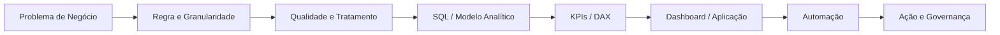

### Data Analytics • Automação • Supply Chain

**Do dado bruto à decisão: SQL, BI, automações e aplicações orientadas ao negócio.**

---

## Sobre meu trabalho

Atuo conectando **dados, operação e automação de processos** para transformar problemas de negócio em soluções estruturadas: definição de regras, tratamento e qualidade de dados, KPIs, dashboards, aplicações, alertas e fluxos automatizados.

Este GitHub funciona como um **portfólio técnico demonstrativo**. Os cases representam tipos de problemas e soluções presentes na minha experiência prática, sempre publicados com **dados fictícios, anonimizados e sem informações confidenciais de terceiros**.

Meu foco no portfólio é mostrar a solução de ponta a ponta — não apenas a tela final.

---

## Cases em destaque

### 01 — Automação de Ruptura & Estoque

Case reproduzível de Supply Chain Analytics que transforma vendas e estoque em **cobertura, criticidade, valor de estoque e priorização automática**.

[Visão do projeto](./portfolio/automacao-ruptura/README.md) • [Apps Script](./portfolio/automacao-ruptura/src/ruptura_demo.gs) • [Dataset sintético](./portfolio/automacao-ruptura/data/sample_estoque.csv)

### 02 — Controle de Caixas & Movimentações — Analytics End-to-End

Pipeline analítico com **qualidade de dados, normalização, SQL Athena/Trino, KPIs, DAX e automação de ação** para monitorar saldo, movimentação, inatividade e valor financeiro.

[Visão do projeto](./portfolio/controle-caixas/README.md) • [SQL](./portfolio/controle-caixas/sql/controle_caixas.sql) • [Medidas DAX](./portfolio/controle-caixas/powerbi/medidas_dax.md) • [Dataset sintético](./portfolio/controle-caixas/data/eventos_demo.csv)

### 03 — Analytics Operations Hub

Aplicação web demonstrativa que centraliza **projetos, dashboards, automações, KPIs, status e próximas ações** em uma única interface responsiva.

[Visão do produto](./portfolio/portal-automacoes/README.md) • [Código da aplicação](./portfolio/portal-automacoes/demo/index.html) • [Preview](./portfolio/portal-automacoes/assets/app-preview.svg)

---

## Outros projetos

| Projeto | Problema | Entrega |
|---|---|---|
| [**Controle de Validade**](./portfolio/controle-validade/README.md) | Priorização de itens próximos do vencimento | Criticidade, valor em risco, ranking e alerta preventivo |
| [**Dashboard Executivo de Supply Chain**](./portfolio/dashboard-supply-chain/README.md) | Visão consolidada de operação | Estoque, cobertura, mix, valor e itens críticos |
| [**Estudo de Mercado**](./portfolio/estudo-mercado/README.md) | Estruturação de análise para decisão | Contexto, indicadores e leitura estratégica |

---

## Como estruturo uma solução de dados

A ideia é manter rastreabilidade entre **origem do dado, regra aplicada, indicador exibido e ação gerada**.

---

## Práticas demonstradas no portfólio

- **Data quality:** validação de eventos, chaves, referências e regras antes do dashboard;
- **SQL e modelagem:** transformação de dados brutos em uma camada analítica orientada a negócio;
- **KPIs e DAX:** métricas com significado operacional e executivo;
- **Reprodutibilidade:** datasets sintéticos e código público para demonstrar a lógica sem expor dados reais;
- **Automação:** alertas e filas de ação conectados aos indicadores;
- **Produto de dados:** aplicações e interfaces pensadas para uso, não apenas apresentação;
- **Governança:** documentação, dicionário de dados e separação entre ambiente público e corporativo.

---

## Stack

**Dados & Analytics**  
`SQL` `Power BI` `DAX` `Excel` `Google Sheets` `Power Query` `Databricks` `AWS Athena / Trino`

**Automação & Desenvolvimento**  
`Google Apps Script` `Python` `Power Automate` `n8n` `HTML` `CSS` `JavaScript`

**Negócio**  
`Supply Chain Analytics` `Gestão de Mix` `Estoque` `Cobertura` `Ruptura` `KPIs` `Melhoria de Processos` `Governança`

---

## Roadmap do portfólio

- [x] Posicionamento profissional focado em Data Analytics
- [x] Case de Ruptura com código e dataset sintético
- [x] Controle de Caixas com SQL, DAX, data quality e dataset sintético
- [x] Aplicação web interativa para o Analytics Operations Hub
- [x] Previews visuais demonstrativos
- [ ] Evoluir Controle de Validade para case reproduzível
- [ ] Separar os principais cases em repositórios individuais
- [ ] Publicar demonstrações navegáveis dos projetos web

---

### Dados + contexto de negócio + automação = decisão mais rápida e execução melhor

**Todos os dados públicos deste portfólio são fictícios ou anonimizados.**

