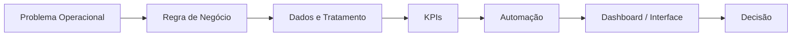

# Michel Lucena
### Dados • Automação • Supply Chain • Planejamento

**Transformando rotinas operacionais em indicadores, automações e soluções para decisão.**

---

## Perfil profissional

Atuo na interseção entre **Planejamento, Supply Chain, Dados e Automação de Processos**. Meu foco é mapear problemas operacionais, estruturar regras de negócio e transformar dados em **KPIs, dashboards, alertas e fluxos automatizados**.

Este GitHub é um **portfólio técnico demonstrativo**. Os cases representam problemas e soluções que fazem parte da minha experiência prática, sempre publicados com **dados fictícios, anonimizados e sem informações confidenciais de terceiros**.

---

## Projetos em destaque

| Projeto | Desafio de negócio | Entrega | Tecnologias |
|---|---|---|---|
| [**Dashboard Executivo de Supply Chain**](./portfolio/dashboard-supply-chain/README.md) | Consolidar visão de estoque, cobertura, mix e desempenho | Painel executivo com KPIs e visão gerencial | Power BI • SQL • Excel |
| [**Automação de Ruptura e Estoque**](./portfolio/automacao-ruptura/README.md) | Identificar rapidamente produtos críticos | Regras de cobertura, rankings, alertas e relatório automatizado | Apps Script • Sheets • HTML |
| [**Controle de Validade e Risco**](./portfolio/controle-validade/README.md) | Priorizar produtos próximos do vencimento | Classificação de risco, valor exposto e alertas automáticos | Apps Script • Sheets • Automação |
| [**Estudo de Mercado e Sortimento**](./portfolio/estudo-mercado/README.md) | Apoiar decisões de mix e portfólio | Análise comparativa de produtos e oportunidades | SQL • Power BI • Analytics |

---

## Minha abordagem

### O que procuro demonstrar em cada case

- entendimento do problema de negócio;
- definição de regras e indicadores;
- organização e tratamento de dados;
- automação de tarefas repetitivas;
- construção de dashboards e interfaces;
- documentação clara da solução;
- visão de impacto operacional.

---

## Stack

**Dados & BI**  
`SQL` `Power BI` `Excel` `Google Sheets` `Power Query` `Databricks` `AWS Athena`

**Automação & Desenvolvimento**  
`Google Apps Script` `Python` `Power Automate` `n8n` `HTML` `CSS` `JavaScript`

**Negócio & Analytics**  
`Supply Chain Analytics` `Gestão de Mix` `Estoque` `Cobertura` `Ruptura` `KPIs` `Melhoria de Processos`

---

## Estrutura dos cases

Cada projeto do portfólio segue uma estrutura próxima à utilizada em projetos reais:

1. Contexto
2. Problema
3. Objetivo
4. Regras de negócio
5. Arquitetura da solução
6. KPIs
7. Tecnologias
8. Demonstração com dados fictícios
9. Resultado esperado
10. Próximas evoluções

---

## Roadmap

- [x] Estruturar posicionamento profissional do perfil
- [x] Criar catálogo inicial de cases
- [ ] Adicionar screenshots e GIFs das interfaces
- [ ] Publicar código demonstrativo dos projetos
- [ ] Criar datasets fictícios para reprodução dos cases
- [ ] Adicionar diagramas de arquitetura e fluxos de automação
- [ ] Publicar um portal demonstrativo dos projetos

---

### Operação + Dados + Automação = decisões melhores e processos mais eficientes

