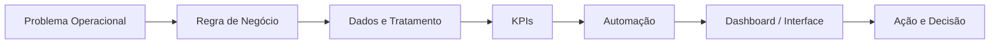

### Dados • Automação • Supply Chain • Planejamento

**Transformando rotinas operacionais em indicadores, automações e soluções para decisão.**

---

## Sobre meu trabalho

Atuo na interseção entre **Planejamento, Supply Chain, Dados e Automação de Processos**. Meu foco é transformar problemas operacionais em soluções estruturadas: regra de negócio, tratamento de dados, KPIs, dashboards, alertas e fluxos automatizados.

Este GitHub funciona como um **portfólio técnico demonstrativo**. Os cases representam tipos de problemas e soluções presentes na minha experiência prática, sempre publicados com **dados fictícios, anonimizados e sem informações confidenciais de terceiros**.

---

## Projetos principais

| Projeto | O que resolve | Entrega |
|---|---|---|
| [**Ruptura & Estoque**](./portfolio/automacao-ruptura/README.md) | Identificação rápida de produtos críticos | Cálculo de cobertura, ranking, relatório HTML e alertas |
| [**Controle de Validade**](./portfolio/controle-validade/README.md) | Priorização de itens próximos do vencimento | Criticidade, valor em risco, ranking e alerta preventivo |
| [**Controle de Caixas & Movimentações**](./portfolio/controle-caixas/README.md) | Visibilidade de saldo e inatividade | KPIs, status, valor associado e automação de ação |
| [**Portal de Automações & Operações**](./portfolio/portal-automacoes/README.md) | Centralização de projetos e rotinas | Portal único com dashboards, automações e governança |

### Case complementar

[**Dashboard Executivo de Supply Chain**](./portfolio/dashboard-supply-chain/README.md) — visão executiva de estoque, cobertura, mix, valor e itens críticos.

---

## Como penso uma solução

Minha abordagem busca conectar **operação + tecnologia + resultado**, e não apenas construir relatórios isolados.

---

## Stack

**Dados & BI**  
`SQL` `Power BI` `Excel` `Google Sheets` `Power Query` `Databricks` `AWS Athena`

**Automação & Desenvolvimento**  
`Google Apps Script` `Python` `Power Automate` `n8n` `HTML` `CSS` `JavaScript`

**Negócio & Analytics**  
`Supply Chain Analytics` `Gestão de Mix` `Estoque` `Cobertura` `Ruptura` `KPIs` `Melhoria de Processos` `Governança`

---

## O que cada case demonstra

- entendimento do problema de negócio;
- definição de regras e indicadores;
- organização e tratamento de dados;
- automação de tarefas repetitivas;
- construção de dashboards e interfaces;
- documentação e governança da solução;
- visão de impacto operacional.

---

## Roadmap do portfólio

- [x] Posicionamento profissional do perfil
- [x] Cases de ruptura, validade, controle de ativos e portal
- [x] Capas visuais demonstrativas
- [ ] Adicionar código reproduzível aos principais cases
- [ ] Adicionar datasets sintéticos completos
- [ ] Publicar GIFs/screenshots das interfaces
- [ ] Criar demonstração web navegável do portal

---

### Operação + Dados + Automação = processos mais eficientes e decisões melhores

**Todos os dados públicos deste portfólio são fictícios ou anonimizados.**

