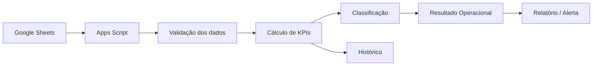

# Automação de Ruptura & Estoque


> **CASE DE PORTFÓLIO — DADOS 100% FICTÍCIOS**

Projeto demonstrativo de monitoramento operacional para transformar uma base de estoque e vendas em **priorização automática, indicadores executivos e alertas recorrentes**.

## Problema de negócio

Acompanhamentos manuais de ruptura consomem tempo, geram versões diferentes da mesma informação e podem atrasar a identificação de produtos que exigem ação.

## Objetivo

Criar uma rotina automatizada capaz de:

- consolidar produtos, estoque e vendas;
- calcular venda média diária e cobertura;
- classificar criticidade;
- gerar rankings por unidade e responsável;
- montar relatório executivo;
- disparar alertas automaticamente;
- manter histórico para análise.

## Regras demonstrativas

| Indicador | Fórmula / regra |
|---|---|
| Venda média diária | Venda 30 dias / 30 |
| Cobertura | Estoque / venda média diária |
| Ruptura | Cobertura < 2 dias |
| Atenção | Cobertura entre 2 e 7 dias |
| OK | Cobertura >= 7 dias |
| Valor de estoque | Estoque × custo unitário fictício |

## Demo reproduzível

Este case agora contém uma versão executável com dados sintéticos:

- [`data/sample_estoque.csv`](./data/sample_estoque.csv) — base fictícia com produtos, estoque, venda e custo;
- [`src/ruptura_demo.gs`](./src/ruptura_demo.gs) — rotina em Google Apps Script que calcula KPIs e cria uma aba de resultado;
- nenhuma informação corporativa ou dado de terceiros é utilizado.

### Como executar

1. Crie uma planilha no Google Sheets.
2. Crie uma aba chamada `BASE_DEMO`.
3. Importe ou cole o conteúdo de `data/sample_estoque.csv` nessa aba.
4. Abra **Extensões > Apps Script**.
5. Cole o conteúdo de `src/ruptura_demo.gs`.
6. Execute a função `executarMonitoramentoRupturaDemo()`.
7. O script cria/atualiza a aba `RESULTADO_DEMO` com os indicadores calculados.

### Saída gerada

A rotina retorna, por SKU:

- venda dos últimos 30 dias;
- venda média diária;
- estoque disponível;
- cobertura em dias;
- custo unitário fictício;
- valor de estoque;
- status `RUPTURA`, `ATENCAO` ou `OK`.

Também gera um resumo com total de SKUs, itens em ruptura, itens em atenção, itens OK, percentual de ruptura e valor total de estoque.

## Arquitetura



## Estrutura do case

```text
automacao-ruptura/
├── README.md
├── assets/
│   └── cover.svg
├── data/
│   └── sample_estoque.csv
└── src/
    └── ruptura_demo.gs
```

## Stack

`Google Apps Script` `Google Sheets` `JavaScript` `HTML/CSS` `Power Automate` `n8n`

## O que este case demonstra

- tradução de regra operacional em lógica automatizada;
- tratamento e consolidação de dados;
- criação de KPIs acionáveis;
- construção de comunicação executiva;
- automação de rotina recorrente;
- preocupação com rastreabilidade e histórico;
- capacidade de transformar uma necessidade operacional em solução reproduzível.

## Resultado demonstrado

O fluxo transforma uma análise repetitiva em um processo **padronizado, auditável e orientado à ação**, permitindo que o usuário concentre tempo nos itens prioritários em vez de montar o relatório manualmente.

## Privacidade

Todos os produtos, unidades, valores e indicadores publicados neste case são fictícios. Nenhum dado corporativo ou informação de terceiros é disponibilizado.

---

**Autor:** Michel Lucena  
**Tipo:** Automação de Supply Chain / Analytics
