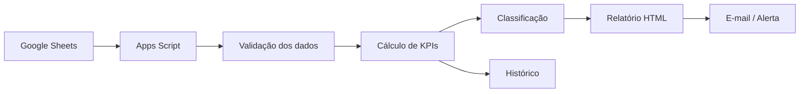

# Automação de Ruptura & Estoque

> **CASE DE PORTFÓLIO — DADOS 100% FICTÍCIOS**

Projeto demonstrativo de monitoramento operacional para transformar uma base de estoque e vendas em **priorização automática, indicadores executivos e alertas recorrentes**.

## Problema de negócio

Acompanhamentos manuais de ruptura consomem tempo, geram versões diferentes da mesma informação e podem atrasar a identificação de produtos que exigem ação.

## Objetivo

Criar uma rotina automatizada capaz de:

- consolidar produtos, estoque e vendas;
- calcular venda média diária e cobertura;
- classificar criticidade;
- gerar rankings por unidade e responsável;
- montar relatório HTML executivo;
- disparar alertas automaticamente;
- manter histórico para análise.

## Regras demonstrativas

| Indicador | Fórmula / regra |
|---|---|
| Venda média diária | Venda 30 dias / 30 |
| Cobertura | Estoque / venda média diária |
| Ruptura | Cobertura < 2 dias |
| Atenção | Cobertura entre 2 e 7 dias |
| OK | Cobertura >= 7 dias |
| Valor de estoque | Estoque × custo unitário fictício |

## Arquitetura

## Stack

`Google Apps Script` `Google Sheets` `JavaScript` `HTML/CSS` `Power Automate` `n8n`

## O que este case demonstra

- tradução de regra operacional em lógica automatizada;
- tratamento e consolidação de dados;
- criação de KPIs acionáveis;
- construção de comunicação executiva;
- automação de rotina recorrente;
- preocupação com rastreabilidade e histórico.

## Resultado demonstrado

O fluxo transforma uma análise repetitiva em um processo **padronizado, auditável e orientado à ação**, permitindo que o usuário concentre tempo nos itens prioritários em vez de montar o relatório manualmente.

## Privacidade

Todos os produtos, unidades, valores e indicadores publicados neste case são fictícios. Nenhum dado corporativo ou informação de terceiros é disponibilizado.

---

**Autor:** Michel Lucena  
**Tipo:** Automação de Supply Chain / Analytics
