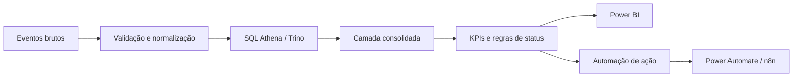

# Controle de Caixas & Movimentações — Analytics End-to-End


> **CASE DE PORTFÓLIO — DADOS 100% FICTÍCIOS**

Case demonstrativo de **Supply Chain Analytics** para consolidar eventos operacionais, calcular saldo, medir inatividade, estimar valor financeiro e transformar indicadores em uma fila de ação.

A proposta do projeto é demonstrar uma solução de ponta a ponta: **regra de negócio → qualidade de dados → SQL → KPIs → Power BI → automação**.

## Problema de negócio

Quando aquisições e movimentações ficam distribuídas em bases diferentes, a operação perde visibilidade sobre saldo, ativos parados, responsáveis e valor financeiro associado. Isso dificulta priorização, acompanhamento e cobrança.

## Perguntas que a solução responde

- Qual é o saldo atual por responsável e CD?
- Quantas caixas foram adquiridas e movimentadas?
- Quando ocorreu a última aquisição e a última movimentação válida?
- Há quantos dias cada responsável está sem movimentar?
- Qual valor financeiro está associado ao saldo?
- Quais responsáveis estão inativos ou com saldo baixo?
- Qual CD concentra maior risco operacional?

## Pipeline analítico



## Regras demonstrativas

| Indicador | Regra |
|---|---|
| Aquisições | Soma de eventos `A` positivos |
| Movimentações válidas | Eventos `M` com `picklist` preenchida |
| Ajuste 32 bits | Se `qtde_raw > 2147483647`, subtrair `4294967296` |
| Saldo atual | Soma das quantidades corrigidas dos eventos válidos |
| Dias sem movimento | Data atual - última movimentação válida |
| Valor das caixas | Saldo atual × R$ 35,00 fictícios |
| Status de movimentação | `ATIVO`, `INATIVO` ou `SEM_MOVIMENTO` |
| Status de saldo | `SALDO_OK`, `SALDO_BAIXO` ou `SALDO_CRITICO` |

## Estrutura reproduzível

```text
controle-caixas/
├── README.md
├── assets/
│   └── cover.svg
├── data/
│   └── eventos_demo.csv
├── docs/
│   └── data_dictionary.md
├── sql/
│   └── controle_caixas.sql
└── powerbi/
    └── medidas_dax.md
```

### Arquivos principais

- [`data/eventos_demo.csv`](./data/eventos_demo.csv) — eventos sintéticos de aquisição e movimentação;
- [`sql/controle_caixas.sql`](./sql/controle_caixas.sql) — consulta Athena/Trino para consolidar KPIs e status;
- [`powerbi/medidas_dax.md`](./powerbi/medidas_dax.md) — medidas DAX para a camada executiva;
- [`docs/data_dictionary.md`](./docs/data_dictionary.md) — dicionário de dados e regras de qualidade.

## Camada de qualidade de dados

O case inclui validações que normalmente ficam escondidas em dashboards simples:

- descarte de movimentação sem referência válida;
- normalização de quantidade em inteiro assinado de 32 bits;
- separação entre aquisição e movimentação;
- tratamento de ausência de movimentação;
- priorização por inatividade e saldo;
- uso de chaves de responsável e CD para manter granularidade.

## KPIs para Power BI

- saldo atual;
- caixas adquiridas;
- caixas movimentadas;
- valor financeiro associado;
- responsáveis inativos;
- percentual de inatividade;
- máximo de dias sem movimento;
- ranking de risco por CD e responsável.

## Automação orientada à ação

A camada analítica pode alimentar um fluxo no **Power Automate** ou **n8n** para gerar alertas somente quando uma regra operacional for atingida, por exemplo:

1. responsável classificado como `INATIVO`;
2. saldo acima de zero;
3. dias sem movimento acima do limite definido;
4. registro encaminhado para uma fila de acompanhamento.

Isso evita transformar o dashboard em apenas uma tela de consulta e conecta o indicador à execução operacional.

## Competências demonstradas

`SQL` `Athena/Trino` `Modelagem de Dados` `Data Quality` `Power BI` `DAX` `Supply Chain Analytics` `Power Automate` `n8n` `Automação de Processos`

Este case evidencia capacidade de trabalhar com **dados brutos, regras de negócio, transformação, modelagem analítica, visualização e automação**, mantendo rastreabilidade entre a origem e a decisão.

## Segurança e privacidade

Todos os CDs, responsáveis, e-mails, valores e eventos publicados são fictícios. Os e-mails usam o domínio reservado `example.com`. Nenhuma base corporativa ou informação de terceiros é publicada.

---

**Tipo:** Data Analytics / Supply Chain / Automação  
**Autor:** Michel Lucena
