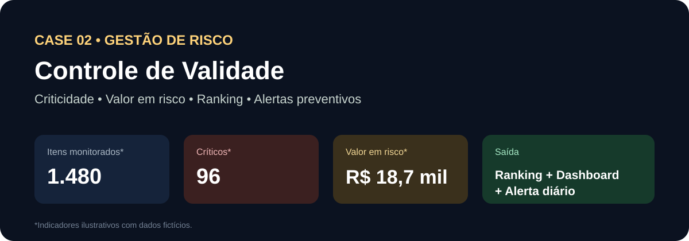
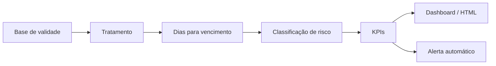

# Controle de Validade & Risco de Perda



> **CASE DE PORTFÓLIO — DADOS 100% FICTÍCIOS**

Projeto demonstrativo para transformar uma base de validade em uma rotina diária de **priorização de risco, acompanhamento financeiro e alertas preventivos**.

## Problema de negócio

Bases extensas dificultam a identificação rápida dos itens que exigem ação. Sem priorização clara, aumenta o risco de vencimento, perda financeira e retrabalho operacional.

## Objetivo

Automatizar a leitura da base e entregar uma visão consolidada com:

- total de itens monitorados;
- itens vencidos;
- itens críticos;
- itens em alerta;
- dias para vencimento;
- valor unitário;
- valor potencial em risco;
- ranking por unidade;
- alertas automáticos.

## Lógica demonstrativa

```text
Data de validade
      ↓
Dias para vencimento
      ↓
Classificação de criticidade
      ↓
Valor potencial em risco
      ↓
Ranking e ação prioritária
```

## Arquitetura



## Stack

`Google Apps Script` `Google Sheets` `Power BI` `SQL` `HTML/CSS`

## O que este case demonstra

- automação de uma rotina preventiva;
- criação de regra de criticidade;
- conexão entre risco operacional e impacto financeiro;
- ranking para priorização;
- comunicação automática para tomada de decisão.

## Resultado demonstrado

A solução reduz o esforço de leitura manual da base e direciona a atenção para os itens de maior urgência e maior impacto potencial.

## Privacidade

As datas, valores, produtos e unidades utilizados publicamente são fictícios. Nenhum dado corporativo ou informação de terceiros é exposto.

---

**Autor:** Michel Lucena  
**Tipo:** Gestão de Risco Operacional / Automação
