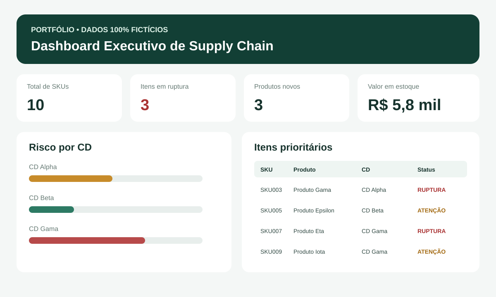

# Dashboard Executivo de Supply Chain

> **CASE DE PORTFÓLIO — DADOS 100% FICTÍCIOS**
>
> Nenhum nome, CNPJ, e-mail, SKU, fornecedor, cliente ou indicador interno de empresa real é utilizado neste projeto.



Projeto demonstrativo criado para mostrar como indicadores operacionais podem ser consolidados em uma visão executiva para tomada de decisão.

## Problema de negócio

Times de operação e planejamento normalmente trabalham com dados dispersos sobre estoque, vendas, cobertura e sortimento. Isso dificulta a identificação rápida de riscos e oportunidades.

## Objetivo

Criar uma visão única que permita acompanhar:

- Total de SKUs
- Estoque disponível
- Cobertura de estoque
- Itens sem venda
- Produtos novos
- Indicadores por centro de distribuição fictício
- Valor de estoque
- Itens críticos

## Arquitetura proposta

`Base sintética CSV` → `Tratamento Python` → `Indicadores` → `Dashboard demonstrativo` → `Priorização operacional`

## Tecnologias

- Python
- CSV
- HTML / CSS
- Power BI como arquitetura de referência
- SQL como evolução futura

## Indicadores demonstrativos

- `Venda média diária = Venda 30 dias / 30`
- `Cobertura = Estoque / Venda média diária`
- `Valor de estoque = Estoque × Custo unitário`
- `Ruptura = cobertura < 2 dias`
- `Atenção = cobertura >= 2 e < 7 dias`
- `OK = cobertura >= 7 dias`

As regras acima existem apenas para demonstrar lógica analítica em portfólio e não representam políticas de nenhuma empresa.

## Estrutura do projeto

```text
dashboard-supply-chain/
├── README.md
├── dashboard.html
├── assets/
│   └── dashboard-demo.svg
├── data/
│   └── dados_ficticios.csv
└── src/
    └── analise_supply_chain.py
```

## Base fictícia

A base contém apenas registros inventados, com nomes como `Produto Alpha`, `Produto Beta`, `CD Alpha`, `CD Beta` e `CD Gama`.

[Visualizar dados fictícios](./data/dados_ficticios.csv)

## Código

O script Python lê a base sintética, calcula venda média diária, cobertura, valor de estoque e classifica o status de cada item.

[Visualizar script Python](./src/analise_supply_chain.py)

## Dashboard HTML

Também foi criado um protótipo visual estático para demonstrar como a camada executiva poderia ser apresentada.

[Visualizar código do dashboard](./dashboard.html)

## Resultado demonstrado

O projeto mostra como transformar uma base operacional simples em uma camada de indicadores capaz de destacar itens prioritários e apoiar decisões de estoque.

## Segurança e privacidade

Este repositório foi criado especificamente para portfólio público.

- Nenhuma base corporativa foi importada.
- Nenhum dado de terceiros foi exportado.
- Nenhum e-mail ou dado pessoal real foi utilizado.
- Nenhum identificador interno de empresa foi utilizado.
- Todos os números e nomes são fictícios.

---

**Autor:** Michel Lucena  
**Tipo:** Projeto demonstrativo de portfólio
