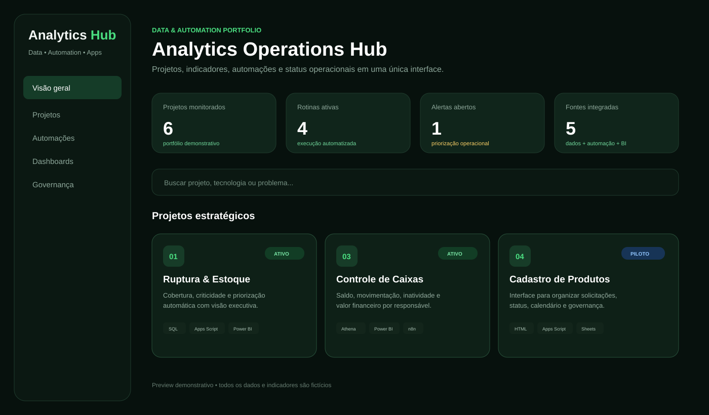
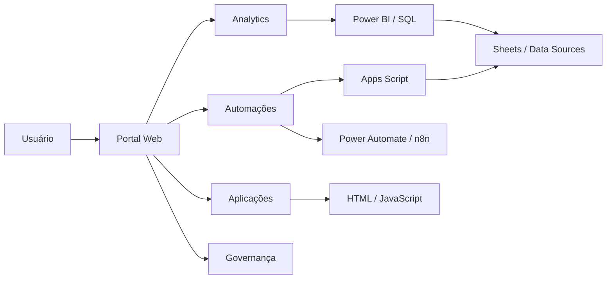
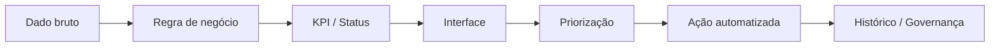

# Analytics Operations Hub — Portal de Dados & Automações




> **CASE DE PORTFÓLIO — CONTEÚDO DEMONSTRATIVO E DADOS 100% FICTÍCIOS**

Aplicação web demonstrativa para centralizar **analytics, dashboards, automações, projetos e governança operacional** em uma única experiência.

Este case representa a evolução de automações isoladas para uma visão de produto: uma interface que conecta **dados + processos + status + decisão**.

## Problema de negócio

Relatórios, planilhas, scripts, dashboards e fluxos distribuídos em diferentes ferramentas aumentam o tempo de busca, dificultam governança e tornam mais difícil enxergar prioridades operacionais.

## Visão da solução

O portal organiza em um único ponto:

- KPIs executivos;
- catálogo de projetos e automações;
- dashboards e aplicações;
- busca por projeto, tecnologia ou problema;
- filtros por Analytics, Automação e Aplicações;
- status operacional;
- data da última atualização;
- stack utilizada;
- próximos passos e ações recomendadas;
- área de governança e documentação.

## Demo interativa

A versão pública inclui uma aplicação estática reproduzível:

- [`demo/index.html`](./demo/index.html) — interface completa com HTML, CSS e JavaScript em um único arquivo;
- [`assets/app-preview.svg`](./assets/app-preview.svg) — preview visual do produto;
- todos os projetos, KPIs e nomes exibidos são fictícios ou demonstrativos.

### Como executar

1. Baixe ou copie o arquivo `demo/index.html`.
2. Abra o arquivo diretamente no navegador.
3. Use a busca e os filtros de categoria.
4. Clique nos cards para abrir detalhes e ações recomendadas.

A demo não depende de backend nem de credenciais e foi desenhada para funcionar como uma vitrine pública segura do conceito.

## Arquitetura de referência



## Jornada de informação



## Práticas demonstradas

### Produto e UX

- navegação simples e responsiva;
- busca e filtros;
- cards com status e tecnologia;
- detalhamento por projeto;
- priorização de próximas ações;
- distinção clara entre ambiente demonstrativo e ambiente protegido.

### Analytics

- visão executiva por KPIs;
- monitoramento de status;
- conexão entre indicador e contexto de negócio;
- organização de projetos por domínio analítico;
- foco em informação acionável, não apenas visualização.

### Engenharia e automação

- HTML/CSS/JavaScript para a camada de interface;
- Google Apps Script como camada de automação e integração;
- Google Sheets ou fontes analíticas como camada operacional;
- Power BI para análises e dashboards;
- Power Automate/n8n para orquestração de ações.

## Estrutura do case

```text
portal-automacoes/
├── README.md
├── assets/
│   ├── cover.svg
│   └── app-preview.svg
└── demo/
    └── index.html
```

## Por que este projeto fortalece o portfólio

O case mostra competências que vão além da criação de um relatório isolado:

- identificação de problema operacional;
- desenho de solução;
- organização de arquitetura;
- construção de interface;
- análise de dados;
- automação;
- experiência do usuário;
- segurança e governança;
- visão de evolução e escalabilidade.

## Stack

`HTML` `CSS` `JavaScript` `Google Apps Script` `Google Sheets` `Power BI` `SQL` `Power Automate` `n8n` `Data Analytics` `Process Automation`

## Segurança

A versão pública é exclusivamente demonstrativa. Dados, usuários, e-mails, links internos, indicadores e informações de terceiros são substituídos por conteúdo fictício. Nenhuma credencial ou ambiente corporativo é exposto.

---

**Tipo:** Aplicação Web / Data Analytics / Automação  
**Autor:** Michel Lucena
