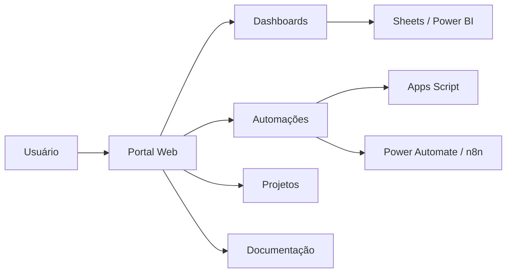

# Portal de Automações & Operações

> **CASE DE PORTFÓLIO — CONTEÚDO DEMONSTRATIVO E DADOS FICTÍCIOS**

Projeto de produto interno para centralizar dashboards, automações, rotinas operacionais e acessos em uma única interface.

## Problema de negócio

Quando relatórios, planilhas, scripts e fluxos ficam distribuídos em diferentes ferramentas, o time perde tempo procurando informações e aumenta o risco de processos duplicados ou desatualizados.

## Visão da solução

Criar um portal único com:

- catálogo de automações;
- dashboards e indicadores;
- páginas por projeto;
- busca rápida;
- status das rotinas;
- responsáveis e última atualização;
- atalhos para ferramentas conectadas;
- área de governança e documentação.

## Arquitetura demonstrativa

## Princípios de produto

1. **Uma única porta de entrada** para o time.
2. **Dados e acessos organizados por projeto**.
3. **Interface simples e corporativa**.
4. **Atualização rápida** sem depender de retrabalho manual.
5. **Separação entre demonstração pública e ambiente real protegido**.

## Stack

`HTML` `CSS` `JavaScript` `Google Apps Script` `Google Sheets` `Power BI` `Power Automate` `n8n`

## Por que este case é estratégico

Ele mostra capacidade de sair do nível de uma automação isolada e pensar em **ecossistema, governança, experiência do usuário e escalabilidade operacional**.

## Segurança

A versão pública é apenas demonstrativa. Dados, usuários, e-mails, links internos e informações de terceiros são substituídos por conteúdo fictício.

---

**Tipo:** Produto interno / Portal de Operações  
**Autor:** Michel Lucena
